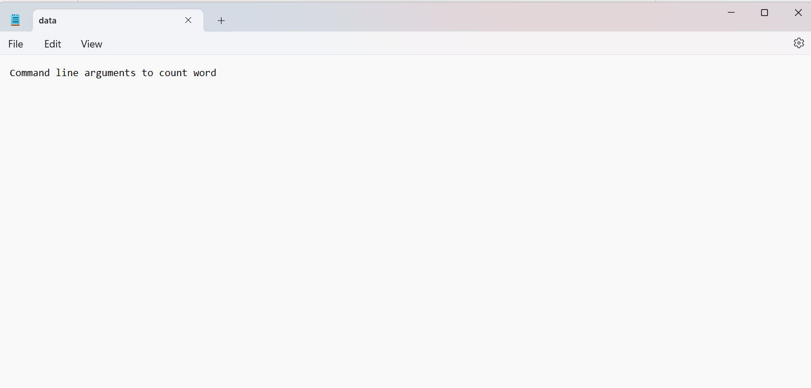
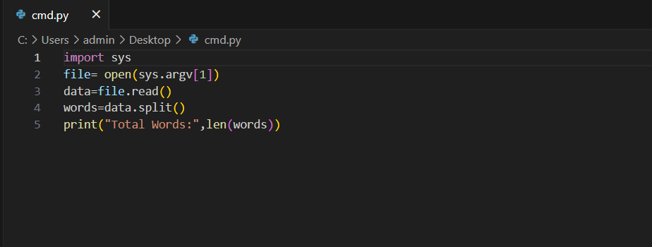
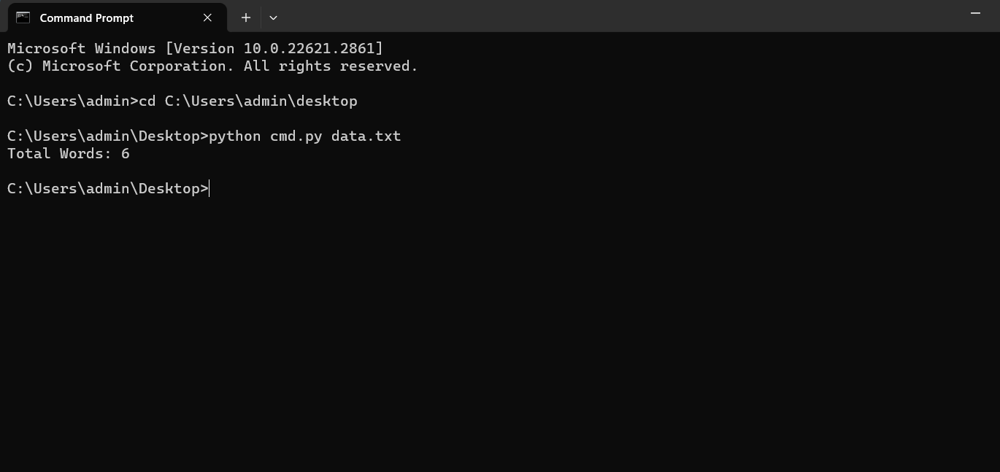

# command-line-arguments-to-count-word
## AIM:
To write a python program for getting the word count from the contents of a file using command line arguments.
## EQUIPEMENT'S REQUIRED: 
PC
Anaconda - Python 3.7
## ALGORITHM: 
### Step 1:
Import the sys module.
### Step 2: 
Pass the filename as the first argument after the name of script. Open the file as sys.argv[1]
### Step 3: 
Read the file using read() method.
### Step 4:  
Use split() method to split the file content into words.
### Step 5: 
Use len() to find the total words.
### Step 6: 
Run the program to determine the number of words in the file created.
## PROGRAM:
```
'''
Developed by : P.KEERTHANA
Registered number : 212223240069
'''
import sys
file= open(sys.argv[1])
data=file.read()
words=data.split()
print("Total Words:",len(words))
```

### OUTPUT:







## RESULT:
Thus the program is written to find the word count from the contents of a file using command line arguments.
